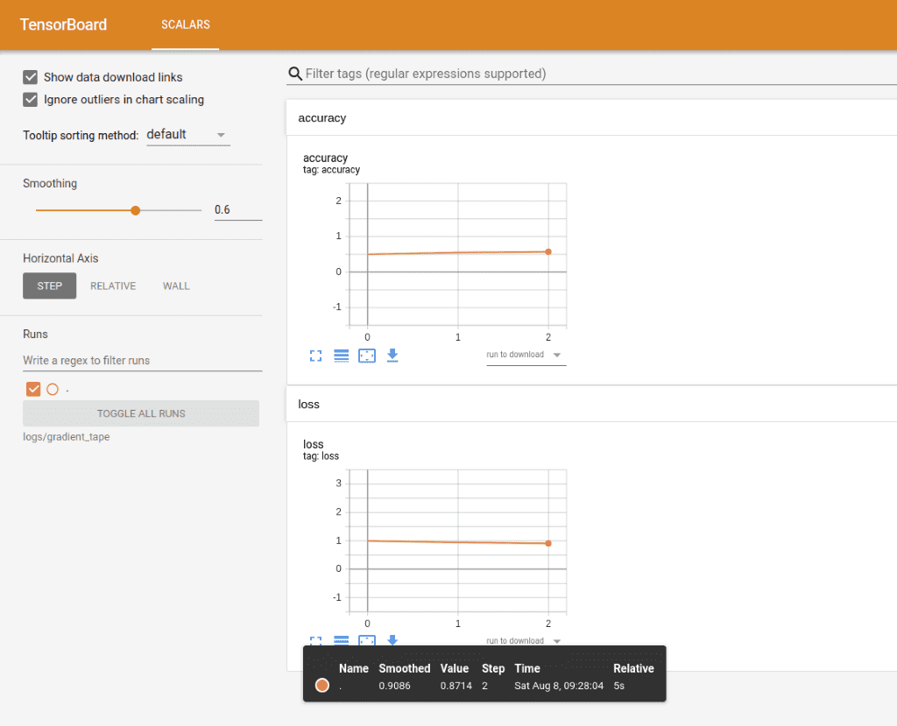

# How to build a custom production-ready Deep Learning Training loop in Tensorflow from scratch

Training is without a doubt the most important part of developing a machine learning application. It’s when you start realizing whether or not your model is worth it, how your hyperparameters should look like and what do you need to change in your architecture. In general, most machine learning engineers spend quite some time on training, experimenting with different models, tuning their architecture and discovering the best metrics and losses for their problem.

In this article, we are continuing the Deep Learning in Production series by building a model trainer for our segmentation example we are using so far. I thought that it would be nice this time instead of outlining the basic topics and software engineering principles, to go through the whole development lifecycle step by step. So, we will program the entire Trainer class as we would do in our day to day job. It is also a great opportunity to apply all the best practices that we talked about in the series. We are going to explore how we can build high performance and highly maintainable software in real-time.

## Building a training loop in Tensorflow
First things first. Let's remember our code so far. All we have in our colab notebook by now is boilerplate Keras code, which includes the model compilation and fit.


```python
self.model.compile(optimizer=self.config.train.optimizer.type,
                   loss=tf.keras.losses.SparseCategoricalCrossentropy(from_logits=True),
                   metrics=self.config.train.metrics)

LOG.info('Training started')
model_history = self.model.fit(self.train_dataset, epochs=self.epoches,
                                       steps_per_epoch=self.steps_per_epoch,
                                       validation_steps=self.validation_steps,
                                       validation_data=self.test_dataset)

return model_history.history['loss'], model_history.history['val_loss']
```

Some things to note here before we continue. Since we get most of our hyperparameters from a config file, I think that it would be useful to know exactly what we are using here. In particular, we choose “SparseCategoricalCrossentropy” as our loss, Adam optimizer and “SparseCategoricalAccuracy” for our main metric.

Also note that I'm using Python 3.7 and Tensorflow 2.0. To see my full setup and follow along, you can revisit the first article of the series where we set up our laptop and outline a high-level overview of our problem and end goal.

To keep things simple, I think we can replace the above code in the train function inside our model class with the code below:

```python
optimizer = tf.keras.optimizers.Adam()
loss = tf.keras.losses.SparseCategoricalCrossentropy(from_logits=True)
metrics = tf.keras.metrics.SparseCategoricalAccuracy()

trainer = Trainer(self.model, self.train_dataset, loss, optimizer, metrics, self.epoches)
trainer.train()
```

All I'm doing here is defining the optimizer, the loss, the metrics and passing them along with the model and the data set in a trainer class called “Trainer”. Once we create a new instance of the class, we can call the train method triggering the beginning of our training.

```
A good practice is to try and keep the class unaware of all the other components of the application such as the model and the data. Each class should have a sole purpose and perform only a single thing without depending on other elements.
```

This is what we call separation of concerns and it is a vital concept to ensure maintainability and scalability of our software.

So, let's define our class in a separate file. I usually have a folder named executors and include there all basic ML functionalities such as training, validation and prediction but you are obviously free to do whatever you like. Each trainer depends on only six things: model, input data, loss function, optimizer, metric and the number of epochs.

Nothing fancy here, as you can see. Inside the Trainer class, we also need a train function, which will have the overall training functionality, and a train_step function that will contain only a single training step.

```
Most of the times, it's preferred to have a custom training loop instead of relying on the high level APIs such as Keras, because we are able to tune every little detail and have full control over the process.
```
In the train_step function, we perform the actual training of a single batch. First, we need to get the training variables aka the model weights and extract the input and the label from the batch.

```python
trainable_variables = self.model.trainable_variables
inputs, labels = batch
```

Then we need to feed the input into the model and calculate the loss based on the labels and the prediction of the Unet.

```python
with tf.GradientTape() as tape:
     predictions = self.model(inputs)
     step_loss = self.loss_fn(labels, predictions)
```

We are using “ tf.GradientTape()” from Tensorflow to capture the gradients during this step, We can then apply them into the optimizer and change the weights accordingly.

```python
grads = tape.gradient(step_loss, trainable_variables)
self.optimizer.apply_gradients(zip(grads, trainable_variables))
```

In essence, we are running the backpropagation algorithm by taking advantage of the APIs provided by Tensorflow.
Finally, we need to update our metric and return the step loss and the predictions to be consumed by the train function.

```python
self.metric.update_state(labels, predictions)
return step_loss, predictions
```


Now let’s go to the train method. The train method will simply be a for-loop that iterates over the number of epochs and a secondary for loop inside, that trains every batch (this is our training step).

```python
def train(self):

    for epoch in range(self.epoches):
        LOG.info(f'Start epoch {epoch}')

        for step, training_batch in enumerate(self.input):
            step_loss, predictions = self.train_step(training_batch)
            LOG.info("Loss at step %d: %.2f" % (step, step_loss))

        train_acc = self.metric.result()
        LOG.info(f'Saved checkpoint: {save_path}')
```

As I mentioned before, we simply have two for loops and a lot of logging. Providing logs is vital so we can have a clear image of what's going on inside the computational graph. In this way, we are able to stop/continue the training based on the info we received from them and to recognize errors and bugs immediately. The LOG variable is a constant defined on the top of the file which initializes a logging util.

A couple of observations before we proceed: First of all, the input is a tensorflow dataset (tf.data) and as you can see, we can iterate over it as we will do for a normal array or list. We also have covered that in a previous article on data preprocessing. Secondly, I'm sure you noticed that we capture both the loss and the accuracy throughout the entire program. This is not just to provide logs but also to enable visualization of our training using Tensorboard More on that in a while.

Thirdly, we need a way to save the state of our training periodically because deep learning models can train for a lot of time. And I mean a lot of time. To avoid losing our weights and to be able to reuse a trained model afterwards, we need to incorporate some sort of checkpoints. Luckily, there is an already built-in functionality for that.


## Training checkpoints
Saving the current state in checkpoints is actually quite easy. All we have to do is define a checkpoint manager and an initial checkpoint to continue the training from there. If it is the first time we train the model, this will be empty otherwise it will be loaded from an external folder. So in our init function, we have:

```python
self.checkpoint = tf.train.Checkpoint(optimizer=optimizer, model=model)
self.checkpoint_manager = tf.train.CheckpointManager(self.checkpoint, './tf_ckpts')
```
The checkpoint is defined by the optimizer and the model while the checkpoint manager by the initial checkpoint and a folder to save them. And to save the current state all we have to do is:

```python
save_path = self.checkpoint_manager.save()
LOG.info(f'Saved checkpoint: {save_path}')
```

We place this usually at the end of each epoch or after a subset of them are completed.

## Saving the trained model
Once the entire training is finished, we want to store our trained model so we can use that to serve actual users. Again, this is quite straightforward in Tensorflow and can be done in a couple of lines:

```python
self.model_save_path = 'saved_models/'
save_path = os.path.join(self.model_save_path, "unet/1/")
tf.saved_model.save(self.model, save_path)
```
And of course, loading a saved model couldn't be that hard either:

```python
model = tf.saved_model.load(save_path)
```

## Visualizing the training with Tensorboard
If you are a visual person like me, logs are not the easiest thing to look at when trying to get a sense of how your training is proceeding. It would be much better to have a way to visualize the process and look at charts instead of lines and lines of logs. If you aren't aware of such a tool, Tensorboard is a way to plot the metrics captured during training and create beautiful graphs for them. It's also a very good way to see the computational graph and get a high-level image of our entire architecture. And it's also a piece of cake to use (surprisingly huh?)

tf.summary is a very elegant method to write our metrics into logs which can be later utilized by Tensorboard. We can build a summary writer using an external path like this:

```python
self.train_log_dir = 'logs/gradient_tape/'
self.train_summary_writer = tf.summary.create_file_writer(self.train_log_dir)
```

And at the end of each epoch, we can use this writer to save the current metrics like the example below:

```python
def _write_summary(self, loss, epoch):

    with self.train_summary_writer.as_default():

        tf.summary.scalar('loss', loss, step=epoch)

        tf.summary.scalar('accuracy', self.metric.result(), step=epoch)
```

Some things to notice here:
- tf.summary.scalar creates a file and writes the metrics under the hood
- The logs are actually saved on a binary format so we can't really read them
- We can either pass the metric as an argument on the function (as we do for the loss) or we can utilize tf.metric that stores the state inside the computational graph

For the latter, we can update the metric inside the graph using

```python
self.metric.update_state(labels, predictions)
```

And then get the current state by:
```python
self.metric.result()
```
where:
```python
self.metric = tf.keras.metrics.SparseCategoricalAccuracy()
```
Once we have the summary written, we can spin up Tensorboard in our localhost by executing the following command:
```python
$ tensorboard --logdir logs/gradient_tape
```

### And behold:


Tensorboard will continue to print the metrics as the training is running. I highly recommend to spend some time and play with it, so you can have a clear sense of all the amazing stuff we can do. It will be very beneficial for your future projects, believe me.

Before we wrap up this article, I would like to mention one thing that we haven't touched upon. And that’s validation. Most of the times, after we perform some sort of training, we apply a validation procedure so we can be sure that our results are correct and their model is not overfitted. Exactly the same principles with the ones we talked so far are applied here. We would still have a test and a test_step function and we would still use tf.metrics, logs and Tensorboard. In fact, it is not that different from training in 90% of the cases. The only difference is that we wouldn’t need to compute the gradients.

## Conclusion
We saw how to build a custom trainer from scratch, along with some best practices to keep it maintainable and extensible. In parallel, we dived into some Tensorflow tricks to make the code much smaller and much simpler. Let me tell you here, that this is exactly the thought process I’d follow in a real-life project and the code that will be run in production will be almost identical to this one. I hope you find this type of article useful and please let us know if you would like to see more of them. Of course, there are always ways and techniques to optimize even further but I think you got the gist of it by now.